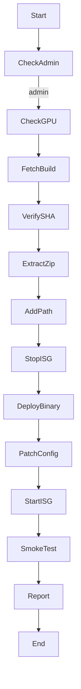

# Plan: Python Automation Script for GPU‑Enabled FFmpeg Installation & iconik Storage Gateway Integration on Windows 11

---

## 1 Objective
Create an idempotent **Python 3.10+** CLI tool (`ffmpeg_isg_setup`) that:
1. Installs/validates a recent NVIDIA driver with NVENC support.
2. Downloads and installs the **full Gyan.dev FFmpeg build** (or a user‑supplied URL).
3. Adds `C:\ffmpeg\bin` to the **System PATH**.
4. Configures / upgrades **iconik Storage Gateway (ISG)** to use this FFmpeg binary.
5. Smoke‑tests hardware encoding and writes a transcript log.

The script must run without internet once artifacts are cached, support **non‑interactive** (CI) and **interactive** modes, and produce a clear success/fail report.

---

## 2 System Prerequisites
| Item | Required Version | Install Hint |
|------|-----------------|--------------|
| Windows 11 64‑bit | 22H2+ | Admin privileges needed |
| Python | 3.10 – 3.12 | `winget install Python.Python.3` |
| NVIDIA Driver | R570+ (Studio/Game Ready) | Manual install or ODM package |
| PowerShell | 7+ (pwsh) | For elevated commands |

> **NOTE:** Script should *detect* missing prerequisites and guide the user rather than attempt silent driver installs.

---

## 3 High‑Level Workflow


---

## 4 Project Structure
```text
ffmpeg_isg_setup/
 ├─ __main__.py        # argparse entry‑point
 ├─ gpu.py             # GPU/driver detection via nvidia‑smi
 ├─ download.py        # resumable download + SHA256 verify
 ├─ extract.py         # safe unzip & move logic
 ├─ env.py             # PATH editing via winreg
 ├─ isg_service.py     # stop/start Windows service & config patch
 ├─ test_encode.py     # runs small encode → parses return code
 ├─ log.py             # Rich‑style console & file logging
 └─ constants.py       # URLs, default paths, error codes
```
Packages: **standard library only** + `requests`, `rich`, `pywin32`, `psutil`.

---

## 5 Detailed Steps & API Contracts
### 5.1 Admin Rights Check
```python
def require_admin() -> None:
    if not ctypes.windll.shell32.IsUserAnAdmin():
        sys.exit("❌  Run this script from an elevated PowerShell or Command Prompt.")
```

### 5.2 GPU & Driver Validation (`gpu.py`)
* Call `nvidia-smi --query-gpu=name,driver_version --format=csv,noheader`.
* Parse driver ≥ 570.xxx else **warn** and continue (don’t auto‑install).

### 5.3 Download & Verify FFmpeg (`download.py`)
```python
FFMPEG_URL = "https://www.gyan.dev/ffmpeg/builds/ffmpeg-release-full.zip"
SHA256_URL = FFMPEG_URL + ".sha256"
```
* Stream download with resume (Range header).
* Cross‑platform SHA256 check.

### 5.4 Extract & Stage (`extract.py`)
* Unzip to `%TEMP%`, then move to `C:\ffmpeg` (configurable).
* Handle existing installs (`--force` flag to overwrite).

### 5.5 Add to System PATH (`env.py`)
* Use `winreg` to edit `SYSTEM\CurrentControlSet\Control\Session Manager\Environment`.
* Broadcast `WM_SETTINGCHANGE` so future shells see new PATH without reboot.

### 5.6 ISG Integration (`isg_service.py`)
1. Locate install dir via `HKLM\SOFTWARE\Pixit\IconikStorageGateway` *or* default `C:\Program Files\IconikStorageGateway`.
2. Stop Windows service: `sc stop "iconik Storage Gateway"` (timeout 30 s).
3. Deploy: copy `ffmpeg.exe` into `bin\` or leave PATH.
4. Patch `config.ini` keys (if present):
   ```ini
   proxy-videocodec = h264_nvenc
   proxy-vbr        = 8000k
   ```
5. Start service, verify status.

### 5.7 Smoke Test (`test_encode.py`)
* Use bundled 5‑second MP4 sample (ship or download once).
* Command:
  ```shell
  ffmpeg -hide_banner -y -hwaccel cuda -i sample.mp4 -c:v h264_nvenc -f null -
  ```
* Check exit code 0 and parse stderr for `NVENC`.

### 5.8 Reporting (`log.py`)
* Write human‑readable `setup_report.txt` and machine JSON.
* Return non‑zero exit on any fatal step.

---

## 6 CLI Usage Examples
```powershell
# Default quick setup
python -m ffmpeg_isg_setup

# Custom download URL and ISG location
python -m ffmpeg_isg_setup `
       --ffmpeg-url https://example.com/ffmpeg.zip `
       --isg-dir "D:\Apps\ISG"
```

Flags of interest:
* `--offline-cache C:\Installers` – re‑use artifacts without internet.
* `--force` – overwrite existing FFmpeg.
* `--no-isg` – skip ISG integration (stand‑alone setup).

---

## 7 Edge‑Case Handling
| Situation | Script Behaviour |
|-----------|-----------------|
| No NVIDIA GPU detected | Exit with code 20 and actionable message. |
| Old driver (<570) | Warn user, offer download link, continue but skip NVENC smoke test. |
| ISG service not installed | Log info; mark step as *skipped*. |
| PATH editing blocked | Suggest manual edit, output the required value. |
| Corporate proxy | Honour `HTTP_PROXY/HTTPS_PROXY` env vars in `requests`. |

---

## 8 Testing Matrix
| Scenario | Expected Result |
|----------|-----------------|
| Fresh VM, internet, ISG present | All steps pass, proxies generated in iconik. |
| Air‑gapped VM with cached zip | Uses `--offline-cache`, installs successfully. |
| User without admin rights | Script aborts at step 1 with clear message. |

---

## 9 Future Enhancements
* **Driver installer automation** via silent `nvidia-installer.exe`.
* **FFmpeg build selector** (AV1 main10, libx264‑only, custom compile flags).
* **ISG config templating** for multiple transcode profiles.
* **Unit tests** with `pytest` + mocks of winreg & service control.

---

## 10 Deliverables
1. **`ffmpeg_isg_setup` package** (pip‑installable wheel + console script).
2. **README.md** with usage & troubleshooting.
3. **setup_report.json/txt** logs for auditing.
4. **CI workflow** (GitHub Actions) running on self‑hosted Windows‑GPU runner.

---

## 11 Timeline (T‑shirt sizing)
| Task | Est. |
|------|------|
| Project skeleton & logging | S |
| GPU/driver detection | S |
| Download/verify module | M |
| Extract + PATH module | M |
| ISG integration | M |
| Smoke test harness | S |
| CLI polish + docs | S |
| CI pipeline | M |
| Total | ~2–3 dev‑days |

---

## 12 References
* Gyan full FFmpeg builds  ➜  https://www.gyan.dev/ffmpeg/builds/
* iconik ISG Windows docs  ➜  https://help.iconik.io/en/articles/3584441-iconik-storage-gateway-windows
* NVIDIA NVENC support    ➜  https://developer.nvidia.com/video-encode-decode-gpu-support-matrix

> **Next step:** Feed this `plan.md` to your AI coding assistant and start scaffolding `ffmpeg_isg_setup` beginning with the project skeleton.
